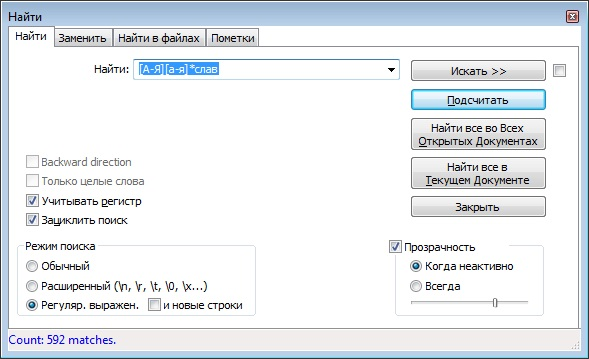

# 1 часть
Судя по структуре текста (см. скриншот 1), все пустые строки объеденяются в блоки:   
___перенос строки   
пробел+перенос строки   
перенос строки___   

### Скриншот 1   

для замены таких блоков используем в программе Notepad++ регулярное выражение __\r\n \r\n\r\n__, для удаления всех пустых строк поле "Заменить на" оставляем пустым и нажимаем кнопку "заменить все".  

### Скриншот 2   

Замена была произведена 391 раз
  
# 2 часть 

Для поиска всех князей и городов, имя и название которых оканчивается на "слав" используем регулярное выражение __[А-Я][а-я]*слав__   

### Скриншот 3   

Всего упоминаний о князьях и городах найдено 592 раза.

# 3 часть
Для поиска всех упоминаний Новгорода используем регулярное выражение __Нов.*?город__   

### Скриншот 4  

Всего упоминаний о городе Новгороде найдено 59 раз.

# Дополнительная часть

Из дополнительного задания догадалась только как после знаков препинания __ , ? ! : ; __ поставить пробел.
Для этого используем регулярное выражение __([,\?!:;])(\S)__, а в троку подстановки вставляем __\1 \2__.

### Скриншот 5

Всего было произведено 9292 замены.

